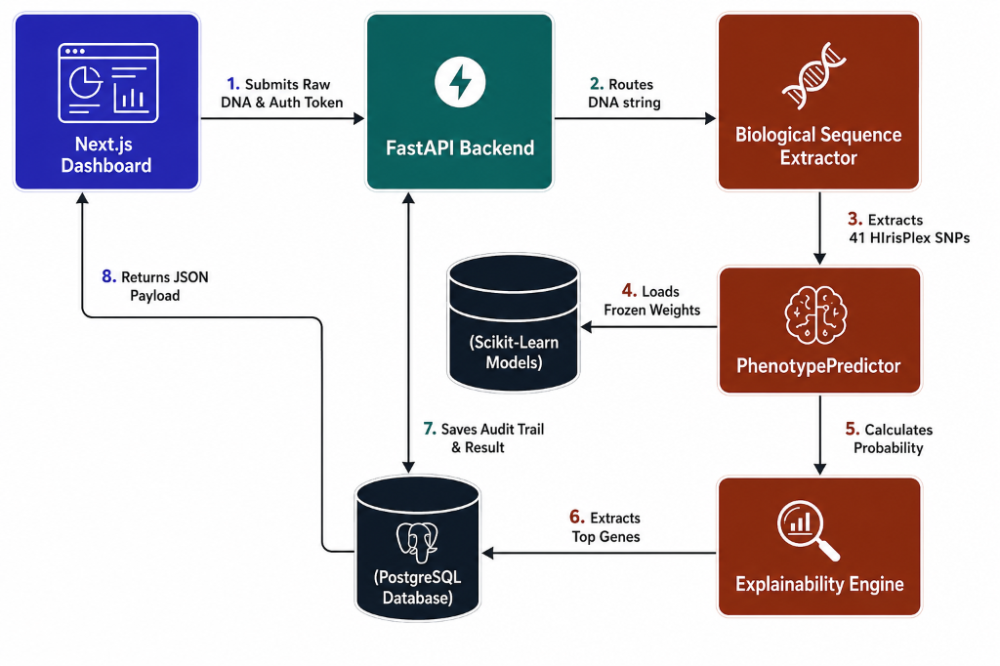
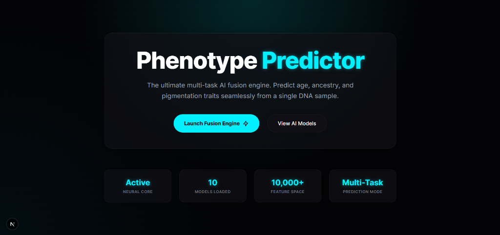
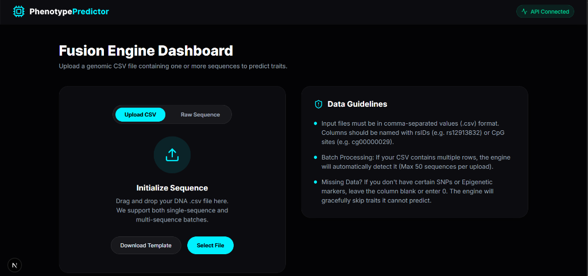
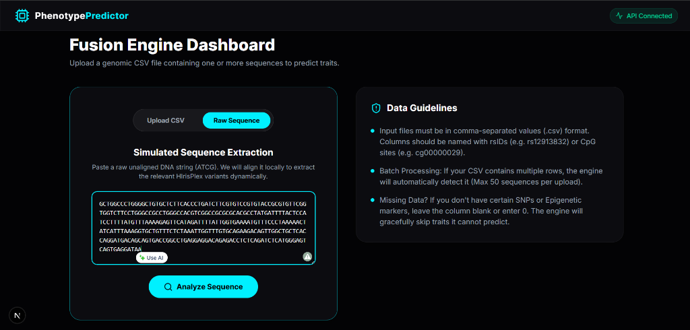
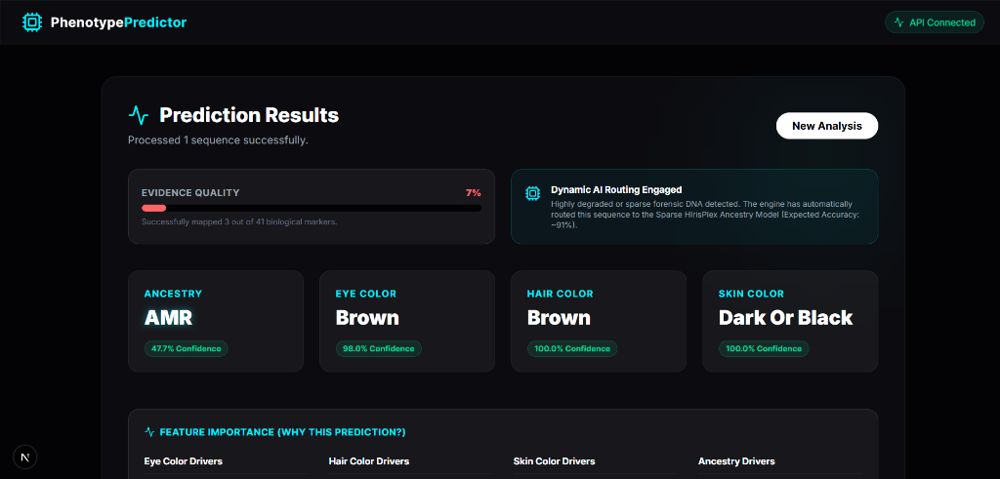
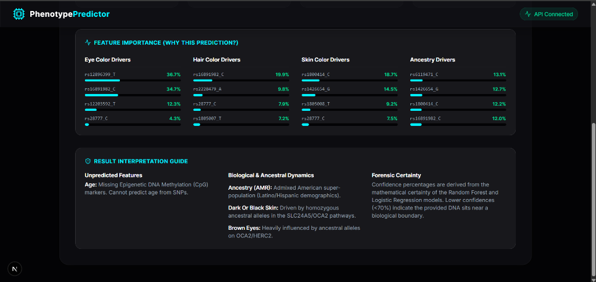

# Forensic Phenotype Predictor (Version 1.0)

A population-aware, multi-model platform designed for forensic genetic phenotyping. It ingests degraded, unaligned raw DNA sequences and accurately infers human physical traits (Eye Color, Hair Color, Skin Color, and Global Ancestry).

## System Architecture Design



## Dashboard Gallery

*The Next.js Forensic Dashboard provides an intuitive interface for uploading DNA and interpreting AI decisions.*

**1. Home Page**


**2. CSV Upload Page**


**3. Raw Sequence Parser**


**4. Prediction Results & Evidence Quality**


**5. Explainability Panel**


## What's New in Version 1.0 (Stable Release)

We have officially transitioned from experimental ML scripts to a fully integrated, production-ready forensic application. 

### 1. The Core Machine Learning Engine
*   **Unified Inference Pipeline:** The `PhenotypePredictor` class now instantly loads 5 distinct, frozen scikit-learn models (`_v1.0.joblib`) into memory on startup.
*   **Dynamic AI Routing:** Real-world forensic DNA is often highly degraded. If a sample contains fewer than 100 SNPs, the system will automatically fall back to the **Sparse Ancestry Model** (trained exclusively on 41 HIrisPlex markers) to guarantee a result without failing.
*   **Imputation Safeguards:** The engine actively calculates the percentage of missing DNA. If a sample is empty, it securely defaults to a "No Prediction" state, blocking the global median bias from hallucinating false traits.

### 2. The Explainability Engine
Pure AI is a "black box," which is unacceptable in legal investigations. We wrote a custom reverse-engineering engine (`explainability.py`) that unpacks the scikit-learn `Pipeline` objects at runtime, extracting the exact mathematical coefficients (`coef_`) and decision tree weights (`feature_importances_`). Every prediction explicitly lists which specific genetic markers (SNPs) drove the decision.

### 3. Biological Data Parser
*   **Strand-Agnostic Extraction:** The `sequence_extractor.py` module allows investigators to paste raw, unaligned A/T/C/G strings straight from sequencing machines.
*   It utilizes robust regex processing and mathematically calculates the `reverse_complement` if the sequence originates from the minus strand.

### 4. Next.js Forensic Dashboard
*   **Evidence Quality Meter:** A visual UI component that calculates `(snps_found / 41) * 100` to give detectives a color-coded confidence score before trusting the AI.
*   **Transparent Routing Banners:** The UI proudly announces which mathematical model was activated via live toast notifications.
*   **Reproducibility Report:** Every prediction is accompanied by reproducibility metadata, including model version, training dataset, software version, and commit hash.

### 5. API & Infrastructure
*   **FastAPI Backend:** Fully asynchronous backend (`/api/v1/predict/raw`) secured with professional standard Python `logging`.
*   **Pytest Integration:** Automated validation! You can now run `python -m pytest` to execute a suite of tests that verifies biological SNP extraction and inference behavior on corrupted DNA.

## Getting Started

### 1. Backend (FastAPI)
```bash
# Install dependencies
pip install -r requirements.txt

# Run the API server
cd backend
uvicorn app.main:app --host 127.0.0.1 --port 8000
```

### 2. Frontend (Next.js)
```bash
# Install dependencies
cd frontend
npm install

# Run the Next.js development server
npm run dev
```

### 3. Run Automated Tests
```bash
# From the project root
python -m pytest
```

## Documentation
*   `PRODUCT.md`: User personas, investigative limitations, and feature roadmap.
*   `benchmark.md`: Official accuracy metrics, latency measurements (Avg. 272ms), and memory requirements.
*   `docs/architecture.md`: Flowchart image visualizing the system infrastructure.
*   `docs/api.md`: REST API endpoint schemas and JSON payloads.
*   `docs/ethics.md`: Guidelines for minimizing population bias and respecting genetic privacy.
